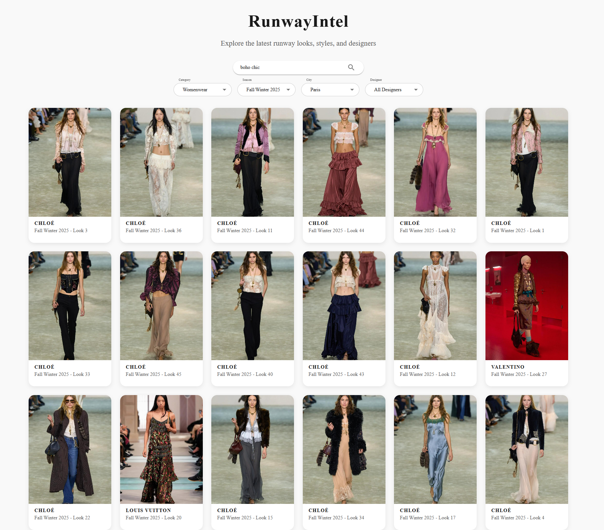

## Runway Search Engine

This project implements a **fashion runway search engine** that allows users to search for runway images using text queries (e.g., "dress with floral pattern"). The system leverages the **CLIP model** for semantic text-to-image matching and **FAISS** for efficient similarity search. Background-removed images are used for feature extraction to focus on clothing, while original runway images are displayed in the results.

### Search Workflow

The search functionality combines **CLIP** (Contrastive Language-Image Pretraining) and **FAISS** (Facebook AI Similarity Search) to deliver fast and accurate results. Here's how it works:

1. **Image Feature Extraction**:
   - Images with removed backgrounds (stored in `fw25-jpg`) are processed using the CLIP model (`CLIP-ViT-L-14-laion2B-s32B-b82K`).
   - Each image is converted to a 768-dimensional feature embedding, normalized for consistent similarity comparisons.
   - Features are extracted once and cached (`features.npy`, `paths.pkl`) to avoid redundant computation.

2. **FAISS Indexing**:
   - The extracted image features are added to a FAISS `IndexFlatL2` index, which uses L2 distance for efficient nearest-neighbor search.
   - The index enables fast retrieval of the most similar images to a given query, even with large datasets.

3. **Query Processing**:
   - A user submits a text query via the FastAPI `/search` endpoint.
   - The query is encoded into a 768-dimensional CLIP embedding using the CLIP model's text encoder and normalized.

4. **Similarity Search**:
   - The query embedding is searched against the FAISS index to find the top `k` (default: 5) closest image embeddings.
   - FAISS returns the indices of the matching images, which are mapped to their corresponding image paths.

5. **Result Delivery**:
   - The matching image paths (from background-removed images) are converted to URLs pointing to the original runway images (in `fw25`).
   - The FastAPI server returns a JSON response with a list of image URLs (e.g., `http://127.0.0.1:8000/fw25/brand/image.jpg`).
   - The frontend fetches and displays the original runway images.

### Why CLIP and FAISS?
- **CLIP**: Encodes text and images into a shared embedding space, enabling semantic matching between natural language queries and visual content.
- **FAISS**: Provides highly efficient similarity search, making it scalable for large image collections.
- **Background Removal**: Using background-removed images for feature extraction ensures the model focuses on clothing, avoiding irrelevant matches based on runway backgrounds.

### Example
- **Query**: "fur coat"
- **Process**:
  - CLIP encodes the query into a feature vector.
  - FAISS finds the images with the closest feature vectors.
  - The system returns URLs to the original runway images.
- **Result**: A list of runway images featuring fur coats.

This workflow delivers a fast, accurate, and user-friendly search experience for fashion runway images.
